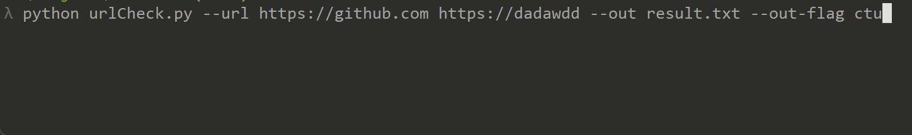

# urlCheck

   

A Simple Python script for check URL valid.

you can use the following command to check if a URL is valid.
```bash
python urlCheck.py --url https://google.com https://youtube.com
```
or check from A file,
```bash
python urlCheck.py --file test.txt
```

want to output result to file

```bash
python urlCheck.py --file test.txt --out result.txt
```

you can set output flag with parameter **out-flag**,default is **tcu**,it's mean file will be sort by Test Time,Test Code,Test URL in every line.

such as :

```bash
python urlCheck.py --url https://github.com https://dadawdd --out result.txt --out-flag ctu
```




## Options

```bash
-h,--help                 show this help message and exit
-url URL [URL ...]        check from string
--file FILE               check from File
--timeout default=3       set timeout
--out OUT				  output to file
--out-flag OUTGLAG        output flag,default is "tcu"
-v,-V,--Version           show program's version number and exit
```


### out-flag

support **t**,**c**,**u**, default if **tcu**,it will sorted by Test time,Test code, Test URL in output file.

you can make any combination with it.


## LICENSE

MIT, Thanks!
